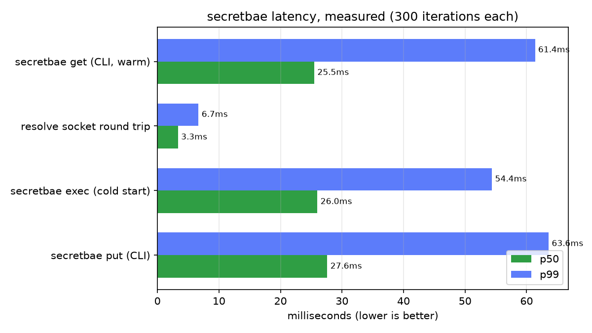

<p align="center">
  
</p>

<h1 align="center">secretbae</h1>

<p align="center"><strong>Encrypted secrets. One binary. Zero cloud dependency.</strong></p>

<p align="center">
  <a href="#licence"></a>
  <a href="https://github.com/sachya/secretbae/actions/workflows/ci.yml"></a>
  <a href="https://sachya.github.io/secretbae/"></a>
  
</p>

If you've ever put a database password in a `.env` file and told yourself you'd fix it properly
later — this is for that. secretbae keeps every secret on your server encrypted, hands them to
your apps automatically when they start, and keeps a tamper-evident record of who touched what
and when. No cloud account, no cluster, nothing else to run.

It's one binary you install in a couple of minutes, and it's small enough to actually read the
whole thing in an afternoon if you want to know exactly what it's doing with your data (you
should want that, for a tool like this). Debian and Ubuntu get a `.deb`; Fedora, RHEL, Arch,
openSUSE and other systemd distributions install from a plain shell script — both are genuinely
tested against real installs, not just assumed to work.

```
secretbae put prod/billing/db_url --value 'postgres://…' --tag env=prod
secretbae exec --profile billing -- /usr/bin/billing-server
```

**New here?** Skip to [What is this, actually?](#what-is-this-actually) or the
[5-minute quickstart](#5-minute-quickstart) — no JSON, no policy authoring, running in five
commands. **Full documentation site:** https://sachya.github.io/secretbae/

## Contents

- [What is this, actually?](#what-is-this-actually)
- [Is this for me?](#is-this-for-me)
- [5-minute quickstart](#5-minute-quickstart)
- [A short glossary](#a-short-glossary)
- [How it works](#how-it-works)
- [Performance](#performance)
- [Install](#install)
- [Tokens and policies, properly](#tokens-and-policies-properly)
- [Giving secrets to an application](#giving-secrets-to-an-application)
- [`secretbae top`](#secretbae-top)
- [Commands](#commands)
- [Security model](#security-model)
- [What this is not](#what-this-is-not)
- [Contributing](#contributing)
- [Layout](#layout)
- [Building and testing](#building-and-testing)
- [Documentation](#documentation)
- [Specifications](#specifications)
- [Licence](#licence)

## What is this, actually?

Every server ends up holding things that must not leak: a database password, an API key for a
payment provider, a TLS private key. The usual places people put these — a `.env` file, an
environment variable baked into a systemd unit, a value pasted into a deploy script — all share
the same problem. The value sits in plaintext somewhere on disk, or in your shell history, or in
a backup nobody thought about, and if it ever leaks, you have no way to know who read it or when
it changed. Most of us have shipped something this way at least once. It's not a character
flaw, it's just what happens when doing it properly looks like a lot of extra work.

secretbae is that extra work, done once, so you don't have to think about it again. It's a small
daemon (`secretbaed`) and a command-line client (`secretbae`) that solve this one problem for
**one server**. Secrets live encrypted in a single file. Only the daemon holds the key that
opens it, and only in memory — never on disk in a form anything could just read. Every change is
versioned, so you can see history and roll back a bad write. Every read and write is checked
against a token and written to a log that detects tampering. Your applications get their secrets
as ordinary environment variables when they start — nothing new for them to learn, no SDK to
import.

### Where secretbae fits

|  | secretbae | `.env` file / bare env vars | Vault / a cloud KMS |
| :--- | :--- | :--- | :--- |
| Time to get running | Minutes — one binary, one command | Already "running" — that's the problem | Hours to days, and usually a whole service or cloud account to manage |
| Where the secret lives | Encrypted on disk; the key stays in locked memory | Plaintext, wherever you put the file | Encrypted, managed for you |
| Who can read what | Checked per token, on every single access | Whoever can read the file — no finer than that | Fine-grained, once it's all configured |
| A record of who touched what | Yes, tamper-evident | No | Yes, once you've set it up |
| Best fit | One server, or a few that don't need to share a secret store | Nothing, honestly — but it's where everyone starts | Many servers, teams, real compliance needs |

None of this is a knock on Vault or a cloud KMS — they're the right call once you're running a
fleet or have a compliance box to tick. secretbae is for the much more common situation of "I
have one server (or a few) and I just want to stop doing the insecure thing," without taking on
a system built for a scale you don't have.

## Is this for me?

| You have… | secretbae fits |
| :--- | :---: |
| One Linux server, or several that don't need to share a secret store | ✅ |
| A handful of services that each need their own database password, API key, etc. | ✅ |
| A preference for running your own small tool over depending on a cloud service | ✅ |
| Multiple servers that need the *same* secrets kept in sync automatically | ❌ — no clustering |
| A Kubernetes cluster wanting secrets injected via CSI or an operator | ❌ — not built for that |
| A compliance requirement for HSM-backed key custody | ❌ — see [the keyfile tradeoff](#security-model) |

If the left column sounds like your setup, keep reading — you'll be up and running in about the
time it takes to read this page.

## 5-minute quickstart

No policy documents, no JSON, nothing to configure first. We'll use the built-in `unrestricted`
policy for your first token, which can read, write and delete anything — great for getting a
feel for the tool, not what you'd hand to a production app. Once you see how the pieces fit
together, locking it down to a scoped policy is one more command (see
[Tokens and policies, properly](#tokens-and-policies-properly)).

```bash
# 1. Install (Debian/Ubuntu shown; see Install for other distributions)
sudo dpkg -i secretbae_0.2.0-1_amd64.deb

# 2. Create the keyfile and the encrypted store. This prints a root token ONCE —
#    copy it now, it cannot be shown again.
sudo secretbaed init
sudo systemctl enable --now secretbaed

# 3. Use that token for the rest of this walkthrough.
export SECRETBAE_TOKEN=sbae_...

# 4. Store something.
secretbae put prod/example/password --value 'hello-world' --tag env=prod

# 5. Read it back, list it, see its history.
secretbae get prod/example/password --raw
secretbae ls --tag env=prod
secretbae versions prod/example/password
```

That's genuinely the whole loop: `put`, `get`, `ls`, `versions`. Everything else in this
README — tags, policies, `exec` for applications, rotation, backups — is just those four
commands with more structure around them.

## A short glossary

None of the rest of this page assumes you already know what these mean, but they'll come up a
lot, so here they are once instead of re-explained every time:

| Term | Meaning here |
| :--- | :--- |
| **Daemon** | A background process. `secretbaed` is the one that actually holds the key and the data; it keeps running after you log out. |
| **Socket** | A local, file-based connection point (`/run/secretbae/sock`) — like a network port, but it only works on this machine, never over the internet. |
| **Token** | A long random string that proves who is asking. Like a password, but generated for you, and revocable instantly. |
| **Policy** | A named rule set saying which paths a token may act on, and with what capabilities. |
| **Capability** | One of `read`, `write`, `delete`, `list`, or `admin` — the specific things a policy can grant. |
| **Tag** | A `key=value` label you attach to a secret, for your own filtering (`env=prod`, `app=billing`). |
| **Version** | Every `put` creates a new, immutable version. Nothing is overwritten; `rollback` just changes which version is "current". |

## How it works

You don't need to understand this section to use secretbae — the quickstart above is the whole
interface. This is here for when you want to know what's actually happening underneath it, or
you're deciding whether to trust it with something real.

`secretbaed` starts as root, reads `/etc/secretbae/master.key` (`0400 root:root`), unseals the
master key into `mlock`ed memory, binds its socket, then **permanently drops to the
unprivileged `secretbae` account** — after which nothing short of root can re-read the keyfile.
It listens only on `/run/secretbae/sock`; the shipped systemd unit sets
`RestrictAddressFamilies=AF_UNIX`, so the absence of a network listener is kernel-enforced
rather than a promise in the code.

`secretbae` is a client of that socket. Applications never talk to it directly: `secretbae exec`
fetches a profile's secrets in **one batched request**, builds the child environment, and
`execve`s into your program. After that the wrapper is gone — serving 200 HTTP requests causes
zero daemon calls.

```
  secretbae (CLI)  ─┐
                    ├─► /run/secretbae/sock ──► secretbaed ──► store.db (encrypted)
  your app ─────────┘    0660 secretbae:secretbae   │
  (via secretbae exec)                              └── master key: mlock'd, memory only
```

## Performance

Measured, not claimed. Run [`sudo bench/run.sh`](bench/run.sh) yourself and get real numbers on
your own hardware — that's the only comparison that's actually fair.



| Operation | p50 | p90 | p99 |
| :--- | ---: | ---: | ---: |
| `secretbae get` (CLI, warm) | 25.5ms | 41.8ms | 61.4ms |
| Resolve socket round trip | 3.3ms | 5.3ms | 6.7ms |
| `secretbae exec` (cold start) | 26.0ms | 36.0ms | 54.4ms |
| `secretbae put` (CLI) | 27.6ms | 45.3ms | 63.6ms |

The interesting number here is the gap between the CLI rows and the resolve socket: most of a
CLI invocation's latency is Linux spawning a new process, not the daemon doing anything — the
daemon itself answers in single-digit milliseconds. That's the actual reason the
[resolve socket](docs/API.md) exists as a second way in: a long-running application that talks
to it directly over its own connection skips the process-startup cost every single time, instead
of paying it on every `secretbae` invocation.

**The honest caveats:** these are 300 iterations of each operation, against a real daemon,
inside a `rust:1-bookworm` Docker container on an 11th Gen Intel Core i5-11300H — not a
dedicated benchmark rig, and container overhead is real. Treat the absolute numbers as "this
order of magnitude, on ordinary hardware," not a promise, and treat the *gap* between the CLI
and socket numbers as the more durable finding, since both were measured the same way on the
same machine in the same run. [`bench/run.sh`](bench/run.sh) is the script that produced them —
run it and check us, rather than taking our word for it.

## Install

**Debian, Ubuntu:**

Download the `.deb` from [Releases](https://github.com/sachya/secretbae/releases/latest), then:

```bash
sudo dpkg -i secretbae_0.2.0-1_amd64.deb
sudo secretbaed init                    # creates the keyfile, prints the root token ONCE
sudo systemctl enable --now secretbaed
```

**Fedora, RHEL, CentOS, Arch, openSUSE, and other systemd distributions:**

```bash
sudo ./packaging/install.sh
sudo secretbaed init
sudo systemctl enable --now secretbaed
```

`install.sh` is plain POSIX `sh`, tested against Fedora and Arch in addition to Debian — real
`useradd`/`groupadd`, a real systemd unit, the exact same capability set as the `.deb`. It needs
`shadow-utils` (`useradd`, `groupadd`, `getent`) and `systemd`; Alpine's busybox equivalents are
not yet supported, since the daemon itself is only verified against glibc.

Neither path starts the daemon automatically: `secretbaed` exits until a keyfile exists, so
starting it before `init` would only produce a failed unit. The root token is displayed once
and cannot be recovered — only its hash is stored.

Rebuild the package or the binaries with `packaging/build-deb.sh`, on the target architecture
or in a container of it.

## Tokens and policies, properly

The quickstart used `--unrestricted` to skip straight to using the tool, which is fine for a
first look but not what you want for a real service. Here's the version that actually scopes
access down to what each app needs. Two policies exist in every store from the moment `init`
runs:

- **`root`** — everything, including token and policy administration. Bound to uid 0; this is
  what the token `init` printed can do.
- **`unrestricted`** — read, write, delete and list on every path, but never `admin`. A token
  attached to it can touch any secret but can never create, revoke or repolicy a token.

Both are real policies, not special-cased bypasses — attaching one still requires generating a
token, and that token can be revoked, expired, or bound to a specific user like any other.

For anything beyond your own experimentation, write a scoped policy instead. A policy is a
JSON document; deny always wins, and `require_tags` only ever narrows a grant the path already
made:

```json
{
  "name": "billing",
  "rules": [
    { "path": "prod/billing/**", "capabilities": ["read", "list"], "require_tags": ["env=prod"] }
  ],
  "deny": [ { "path": "prod/**/admin/**" } ]
}
```

Path globs are segment-aware: `*` matches one segment, `**` matches zero or more, and neither
crosses a segment boundary — `prod/billing/**` does not match `prod/billing-admin/db`.

```bash
secretbae policy put --file billing-policy.json
secretbae token create --name billing --policy billing --bind-uid www-data --ttl 90d
```

**Always set `--bind-uid`.** It binds the token to a local account via `SO_PEERCRED`, which the
kernel supplies and the caller cannot choose. A token bound to `www-data` is inert for every
other uid, including root — this is the single most effective control available here, and it
costs one flag.

## Giving secrets to an application

This is the part your application actually experiences: it starts up, and its secrets are just
already there as environment variables. It never talks to secretbae, imports a library, or knows
this tool exists. Write `/etc/secretbae/profiles/billing.toml`:

```toml
token_file = "/etc/secretbae/tokens/billing.token"   # 0440 root:billing

[[env]]
name = "DATABASE_URL"
path = "prod/billing/db_url"

[[env_from]]                       # map a whole prefix to environment variables
prefix = "prod/billing/runtime/"
transform = "screaming_snake"      # …/api_key -> API_KEY
```

Then change one line in the service unit:

```ini
ExecStart=/usr/bin/secretbae exec --profile billing -- /usr/bin/billing-server
```

Secrets never touch disk. The tradeoff: because values are copied into the process once,
**rotating a secret requires restarting the consuming service.** If your application is
long-running and needs to notice a rotated secret on its own, it can read the resolve socket
directly instead — see [API.md](docs/API.md) for the wire format and copy-paste Python and PHP
clients that need no library at all.

## `secretbae top`

A live metadata browser, in the spirit of `top`:

```
 ▍SECRETBAE top · live metadata                                       ● LIVE  12:57:26 UTC
 socket /run/secretbae/sock │ keys 6/6 │ versions 11
╭─ KEYS 6 ───────────────────────────────────────────────────────────────────────────────────╮
│  KEY ▲                         VERSIONS  CURRENT  TAGS                      UPDATED        │
│▶ dev/api/token                 1 ▮       v1       app=api  env=dev          0s ago         │
│  prod/billing/db_url           5 ▮▮▮▮▮   v5       app=billing  env=prod     2m ago         │
│  prod/billing/stripe_key       1 ▮       v1       app=billing  env=prod     2m ago         │
│  staging/api/token             2 ▮▮      v2       app=api  env=staging      5m ago         │
╰────────────────────────────────────────────────────────────────────────────────────────────╯
 ↑↓  move   ↵  versions   /  filter   t  tag   s  sort   p  pause   q  quit
```

Production tags render red, staging amber, development green. `Enter` opens the version pane
for a key; `/` filters by path; `t` cycles the tags present in the view; `s`/`S` sorts.
`--interval <secs>` changes the 2-second refresh; `--once` prints a single frame and exits, for
scripts and cron — it needs no terminal and honours `COLUMNS`/`LINES`.

**It never shows a secret's value.** The `read` and `resolve` routes are unreachable from it and
a test enforces that — a full-screen value display would leak into terminal scrollback and any
screen share. Use `secretbae get` when you actually need a value.

## Commands

| Command | Purpose |
| :--- | :--- |
| `status` | Daemon state, schema version, master-key generation, secret count. |
| `put` / `get` | Write a new version / read one. `--stdin`, `--file`, `--value`; `--raw`, `--json`. |
| `ls [prefix]` | List secrets, filtered by path prefix and `--tag`. |
| `versions` / `rollback` | Inspect history / re-point `current` without discarding anything. |
| `rm` | Soft-delete a version, or `--destroy` to discard its ciphertext irreversibly. |
| `tag add\|rm\|ls` | Manage `key=value` labels. `rm` also takes a bare key. |
| `token create\|list\|revoke` | Issue tokens. `--policy <name>` and/or `--unrestricted`, plus `--bind-uid` and `--ttl`. |
| `policy put\|list\|rm` | Manage access-control documents. |
| `exec --profile N -- cmd` | Batched fetch, then `execve` into the application. |
| `top` | Live metadata browser. |
| `rekey` | Rotate the master key; rewraps every data key and re-keys the audit chain. |
| `backup` / `restore` | Encrypted bundle under an independent passphrase. |
| `audit verify` | Walk the hash chain and report the first break. |
| `completions <shell>` | Shell completion script. |

## Security model

This is the part worth reading slowly before you trust it with anything real. Every single
request has to clear three independent gates:

1. **Filesystem** — the socket is `0660 secretbae:secretbae`; the caller's user must be in the group.
2. **Token** — valid, unexpired, unrevoked, and carrying a policy granting the capability. Only
   `SHA-256(token)` is stored, compared in constant time.
3. **Peer credentials** — the daemon reads the connecting process's real uid via `SO_PEERCRED`,
   which the kernel supplies and the caller cannot choose. A token bound to `www-data` is
   **inert for any other local account, including root**.

Supporting properties:

- **Envelope encryption.** Every version gets a fresh data key wrapped by the master key, so
  `rekey` rewrites 32-byte keys instead of re-encrypting every payload.
- **Ciphertext is bound to its slot.** The AEAD's associated data binds `(secret_uuid, version)`,
  so a row moved between secrets in the database will not decrypt.
- **Runs unprivileged.** Root is held only long enough to read the keyfile; the drop uses
  `setres*id` so the saved id cannot restore it, and the result is re-read from the kernel
  rather than trusted. The shipped unit grants five capabilities
  (`CAP_SETUID CAP_SETGID CAP_CHOWN CAP_DAC_OVERRIDE CAP_FOWNER`), and a test fails the build if
  the daemon can start with any one of them removed.
- **Tamper-evident audit.** A keyed BLAKE3 chain plus an authenticated anchor, detecting modified
  entries, deleted entries *and* truncation of the tail. `rekey` refuses to run on a chain that
  does not verify, so rotation cannot launder away evidence.
- **The `unrestricted` policy never includes `admin`.** A token that can read and change every
  secret still cannot mint or revoke tokens or edit policy — the blast radius of a leaked
  unrestricted token stops at data, it does not reach access control itself.
- **Errors reveal nothing.** A missing path, a deleted version and a denied request all answer
  `not found or not permitted`.

Explicitly out of scope: host root compromise (root can `ptrace` the daemon), kernel compromise,
physical memory attacks, and a malicious operator. See
[THREAT_MODEL.md](docs/THREAT_MODEL.md) for the full analysis, including the residual risk of
keeping the keyfile on the same filesystem as the store.

## What this is not

Being upfront about the edges of this thing matters more to us than making it sound bigger than
it is:

| Non-goal | Why |
| :--- | :--- |
| **Not a network service** | Local Unix socket only. No TCP or UDP is opened, and the systemd unit enforces `AF_UNIX` at the kernel level. |
| **Not multi-host** | State is one SQLite file on one machine. No replication, no consensus, no clustering. |
| **Not a managed KMS** | The store and its keyfile share a filesystem, so disk-image or backup theft compromises both. Backups are sealed under a separate passphrase to limit this; a TPM2 seal backend would close it and is the sanctioned extension point. |

## Contributing

Issues and pull requests are genuinely welcome — including the small stuff, like a confusing
sentence in these docs. Before sending a change:

```bash
cargo fmt --all
cargo clippy --workspace --all-targets -- -D warnings
cargo test --workspace
```

See [CONTRIBUTING.md](CONTRIBUTING.md) for the full workflow, and
[SECURITY.md](SECURITY.md) if what you found is a vulnerability rather than a bug — please
don't open a public issue for that.

## Layout

| Crate | Responsibility |
| :--- | :--- |
| `sbae-core` | Key hierarchy, envelope encryption, seal backends, backup bundles. No I/O. |
| `sbae-proto` | Validated domain types (`SecretPath`, `Tag`, `Version`) and the wire contract. |
| `sbae-store` | SQLite schema, versioning, retention, tags, tokens, policies. No cryptography. |
| `sbae-policy` | Token authentication and policy evaluation. Pure functions, no I/O. |
| `sbae-audit` | Keyed hash chain, anchor, verification and chain re-keying. |
| `sbae-daemon` | `secretbaed`: privileged startup, privilege drop, HTTP-over-UDS handlers. |
| `sbae-cli` | `secretbae`: client, `exec` wrapper, and the `top` browser. |

`#![forbid(unsafe_code)]` holds everywhere except one reviewed module in `sbae-daemon`, which
needs `mlock`, `prctl` and `setresuid`; every block there documents its invariant.

## Building and testing

The daemon is Linux-only — it depends on Unix sockets, `SO_PEERCRED`, `mlock` and `setresuid`.

```bash
cargo test --workspace
cargo clippy --workspace --all-targets -- -D warnings
```

From a non-Linux machine, build and test in a container:

```bash
docker run --rm -v "$PWD:/src" -w /src --ulimit memlock=-1 rust:1-bookworm cargo test --workspace
```

## Documentation

The full documentation site is at **https://sachya.github.io/secretbae/**, built from the
same files linked below.

| Document | Contents |
| :--- | :--- |
| [OPERATIONS.md](docs/OPERATIONS.md) | Install, initialise, tokens, exec profiles, systemd wiring, rotation, backup/restore, audit verification, disaster recovery, troubleshooting. |
| [THREAT_MODEL.md](docs/THREAT_MODEL.md) | Assets, trust boundaries, attacker profiles, mitigations and residual risk. |
| [API.md](docs/API.md) | The full HTTP/JSON wire API, and the minimal resolve-socket protocol for reading secrets from your own code. |
| [CHANGELOG.md](CHANGELOG.md) | What changed in each release. |

## Specifications

| Property | Value |
| :--- | :--- |
| AEAD | XChaCha20-Poly1305, 24-byte random nonces |
| Key derivation | HKDF-SHA256 for the KEK and audit key |
| Passphrase KDF | Argon2id — 64 MiB, 3 iterations, 4 lanes (backup bundles only) |
| Key hierarchy | Envelope: a data key per version, wrapped by the master key |
| Audit chain | Keyed BLAKE3 with an authenticated length-and-tail anchor |
| Storage | SQLite, WAL, foreign keys, `STRICT` tables |
| Paths | Lowercase `[a-z0-9._-]`, max 16 segments, max 512 bytes |
| Retention | Newest 10 versions per secret by default |
| Seal backends | Keyfile (shipped); TPM2 is the sanctioned extension point |
| Capabilities held | `CAP_SETUID CAP_SETGID CAP_CHOWN CAP_DAC_OVERRIDE CAP_FOWNER`, all surrendered at the privilege drop |
| Built-in policies | `root` (uid 0, everything); `unrestricted` (all secret capabilities, never `admin`) |
| Tested distributions | Debian, Ubuntu (`.deb`); Fedora, Arch (`install.sh`) — see [OPERATIONS.md](docs/OPERATIONS.md) |

## Licence

Dual-licensed under [MIT](LICENSE-MIT) or [Apache License, Version 2.0](LICENSE-APACHE), at
your option.

---

If secretbae saved you from writing another `.env` file, a star helps the next person who's
about to do the same thing find it instead. Bug reports, questions, and pull requests are all
welcome — see [Contributing](#contributing).
