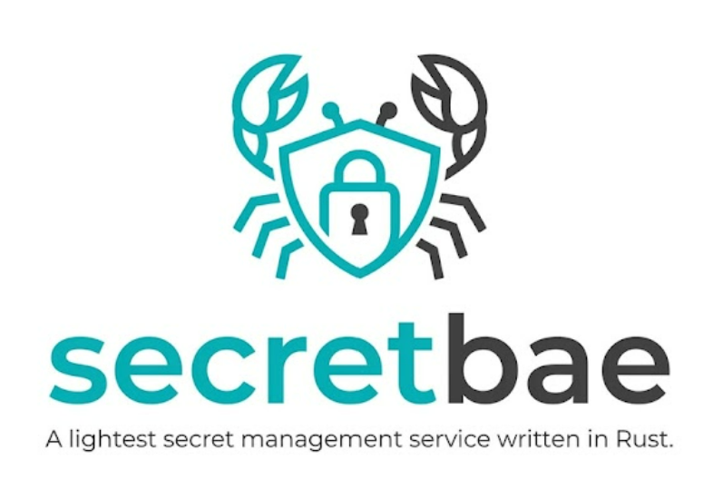

<p align="center">
  
</p>

# secretbae

**Encrypted secrets. One binary. Zero cloud dependency.**

If you've ever put a database password in a `.env` file and meant to fix it properly later —
this is for that. secretbae keeps every secret on your server encrypted, hands them to your
apps automatically when they start, and keeps a tamper-evident record of who touched what and
when. No cloud account, no cluster, nothing else to run.

Debian and Ubuntu get a `.deb`; Fedora, RHEL, Arch, openSUSE and other systemd distributions
install from a plain shell script — both are genuinely tested against real installs, not just
assumed to work.

```
secretbae put prod/billing/db_url --value 'postgres://…' --tag env=prod
secretbae exec --profile billing -- /usr/bin/billing-server
```

## Where to start

- **New to secret managers, or to secretbae specifically?** The
  [README](https://github.com/sachya/secretbae#readme) has a plain-language explanation of the
  problem this solves, a checklist for whether it fits your setup, and a 5-minute quickstart
  that needs no policy authoring.
- **Running it on a host?** [Operations](OPERATIONS.html) covers install, tokens, giving
  secrets to an application, rotation, backup and restore, and troubleshooting.
- **Evaluating whether to trust it with something real?** [Threat Model](THREAT_MODEL.html)
  states exactly what is defended against, what mitigates each threat, what the residual risk
  is, and which test proves each claim — including what is explicitly *not* defended against.
- **Writing a client, or reading a secret from your own long-running process?** [API](API.html)
  documents the full HTTP/JSON surface and a minimal plain-text socket protocol for reading
  secrets without an HTTP client or a JSON parser.
- **Want the exact CLI surface?** `secretbae --help`, or any subcommand's `--help`, is the
  source of truth; the README's command table is a summary of it.

## The shape of it

```
  secretbae (CLI)  ─┐
                    ├─► /run/secretbae/sock ──► secretbaed ──► store.db (encrypted)
  your app ─────────┘    0660 secretbae:secretbae   │
  (via secretbae exec)                              └── master key: mlock'd, memory only
```

`secretbaed` starts as root only long enough to read a root-owned keyfile and unseal the
master key into locked memory, then drops privileges permanently. It listens on a Unix socket
only — never a network port. Applications receive their secrets once, at process start, via
`secretbae exec`, and the daemon is not involved again while they serve traffic.

Three independent gates protect every request: filesystem permissions on the socket, a hashed
bearer token, and the kernel-supplied uid of the connecting process — a token bound to one
account is inert for every other account, including root.

## Source and licence

[github.com/sachya/secretbae](https://github.com/sachya/secretbae) — dual-licensed under MIT
or Apache-2.0, at your option. See [CHANGELOG](https://github.com/sachya/secretbae/blob/master/CHANGELOG.md)
for what changed in each release.
